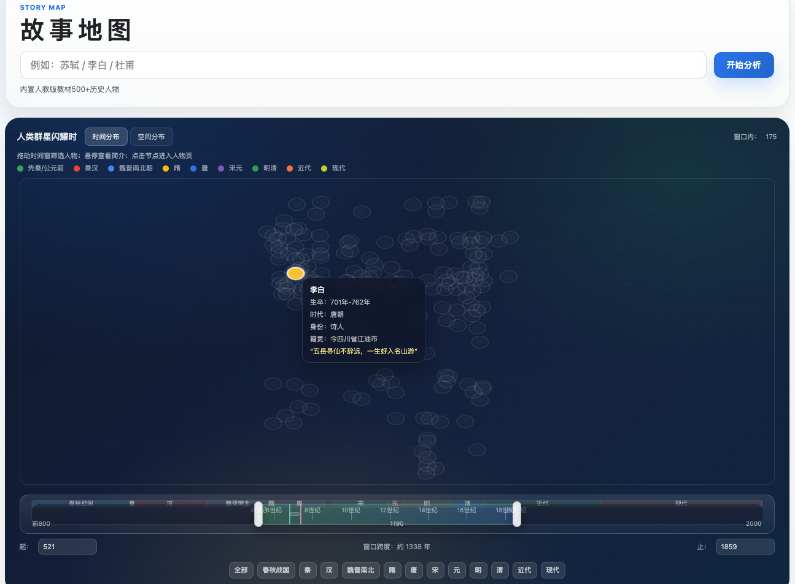
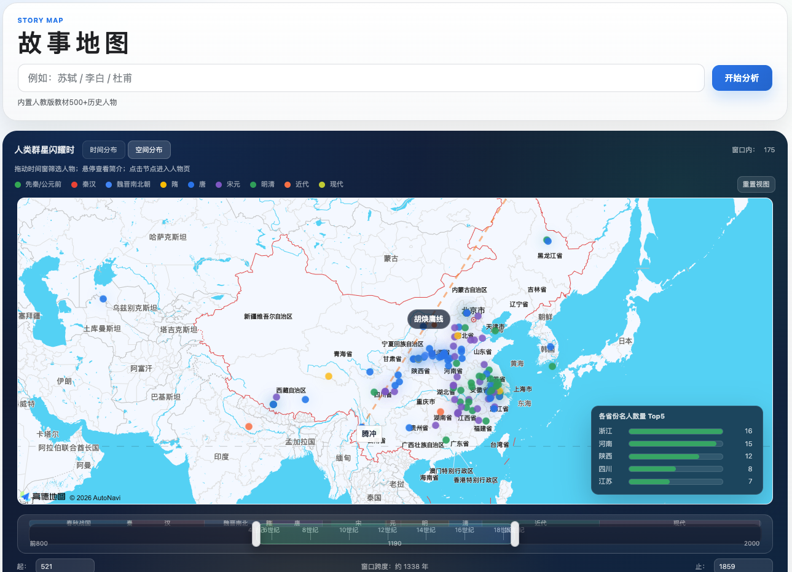
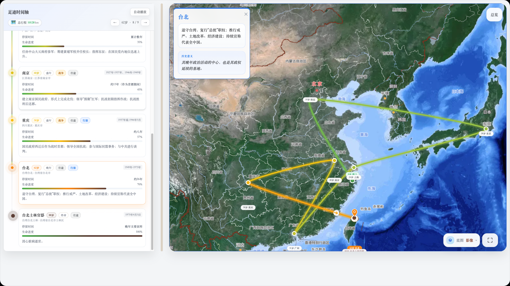
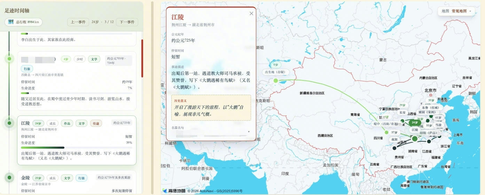
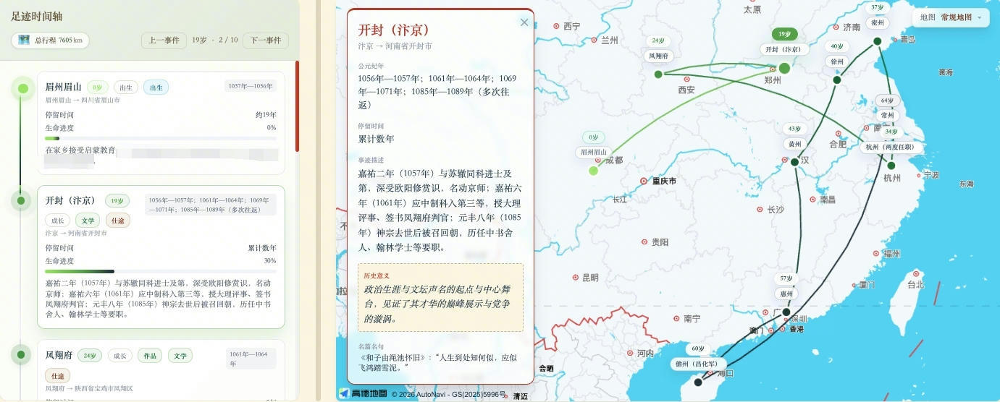
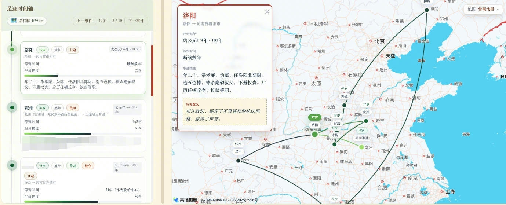
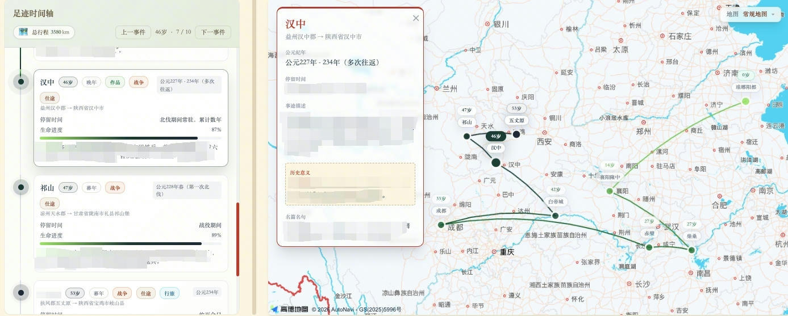

<h1 align="center">🗺️ 故事地图StoryMap</h1>

  <strong>从时空视角重构历史人物的生命轨迹</strong>

  面向语文、历史、地理跨学科教学的历史人物时空分析Agent

  
  
  
  
  
  

  <a href="https://www.bilibili.com/video/BV1aLoCBnEiN">故事地图视频演示</a> ·
  <a href="#演示与在线静态版">在线静态版</a> ·
  <a href="./install.md">安装、部署与维护文档</a>

## 目录
- [项目概况](#项目概况)
- [适用场景](#适用场景)
- [在线演示](#演示与在线静态版)
- [快速开始](./install.md)
- [作者信息](#作者信息)

> 📚 工程视角文档（架构、目录、重组路线图）：见 [`docs/`](./docs/README.md)

## 项目概况
**故事地图（StoryMap）** 面向文史爱好者，遵循 **“人物—时空—事件”** 的叙事主线，提供一个可理解任务、调用工具、输出证据的历史人物时空分析入口。输入一个人物，就能生成可交互的足迹地图、结构化人物档案与追问式回答。

🧭 **项目目标：**借助地图，我们可以把文学与历史研究中偏感性、经验性的“人物分析”，转成可回放、可检索的**时空轨迹**，关注行走与迁徙的轨迹，而不仅仅某个时间切片的个人经历。

**从时空视角重构历史人物生命轨迹，解决文史学习中“文本碎片化、时空理解弱、检索成本高”的痛点。**

近期的前端性能优化已经覆盖两条主链路：

- **首页首包瘦身**：首页数据已拆成 `stellar_home_data.json` 与 `stellar_home_data_detail.json`，先加载核心索引，再空闲补载重字段。
- **人物页地图延迟加载**：人物页正文与时间轴优先渲染，地图进入视口后再初始化，减少首屏等待。
- **构建期性能基线**：完整构建后会产出 `data/reports/performance_baseline.json`，用于对比首页 HTML、首页数据包和典型人物页体积。
- **批量重渲染默认不补点**：模板或前端改动触发的批量人物页重建默认走 `nogeocode`，避免把少量长尾地名的 geocode 超时放大成整轮构建阻塞。

🛠️ **技术方案：**
- **1. 理解任务，识别人名**：支持输入姓名、短问题或多人物文本，先识别任务对象，再决定进入生成、检索或问答流程。
- **2. 组织证据，生成档案**：通过 LLM 检索与整理资料生成结构化内容，重点抽取 **时间 - 地点 - 事件 / 作品 - 意义**。
- **3. 调用地图工具，完成落图**：集成 **高德地图** 进行古今地名对照与地理编码，实现位置信息的精准可视化。
- **4. 输出结果，支持追问**：基于人物足迹、时间轴和事件节点生成联动页面，并通过对话窗口继续解释“为什么”“依据是什么”“和谁相似”。

### Agent 化工作流
- **任务理解**：接收人物名、提问句或多人物比较请求
- **对象识别**：识别人名并优先命中本地人物档案
- **证据组织**：生成结构化人物信息与时间线
- **地点解析**：补全古今地名映射与坐标
- **时空呈现**：生成可交互地图、时间轴和人物页
- **追问回答**：优先基于本地档案回答，再结合模型补全表达

## 🎯 适用场景
面向中学教学与文史学习场景，适合把人物、地点、事件和作品在同一时空框架中理解。

- **语文人物专题课**：围绕李白、苏轼、辛弃疾等人物，将作品、行旅和人生转折放在地图与时间轴中联动讲解。
- **历史人物时空复盘**：从迁徙、贬谪、出使、征战、治学等轨迹切入，帮助学生理解人物处境与时代背景。
- **跨学科研学展示**：适合语文、历史、地理融合展示，也适合校本课程、研学汇报与文化展陈场景。

🌍 从更宏观的视角重看历史人物：沿着他的足迹，我们能更容易洞悉成长变化，也能看到他与其他人物在时空上的关联。

- **💡 辅助高效备课**：自动抓取人物生平，省去翻阅史料、查找古地名的繁琐过程。
- **📍 直观展现轨迹**：将文字叙述转化为地图足迹，人物生平一目了然。
- **📚 跨学科教学**：契合「大语文」、「大历史」学科融合理念，在地图中讲诗词，在地理中读历史。
- **✨ 吸引学生注意**：可交互网页支持时间轴联动和事件弹窗，让课堂更有参与感。

## 📸 在线演示
#### [如果历史人物的一生能展开成地图，会是什么样？](https://www.bilibili.com/video/BV1aLoCBnEiN)

演示内容包括：
- 主页：人类群星闪耀时 🌟 时间轴联动
- 人物页：人物要点 🌏 地图轨迹 
- 人物页：穿越时空的对话 ☁️

  
  
  

主页默认展示：
- 输入框：输入人物姓名、问题或任务，即可发起分析/跳转到人物页
- 时间轴：「人类群星闪耀时」关系图，查看闪耀的人物群星
- 地图视角：从空间视角观察中国历史文化名人分布
- 支持拖动筛选，起止年份可自定义，并查看任务执行进度
- 首页优先加载轻量核心数据，作品摘要、长评等重字段会在空闲阶段补载

人物页默认展示：
- 人物简介
- 足迹地图（支持矢量图，影像图，地形图，3D地形图）
- 时空对话
- 考点信息
- 地图按需加载，滚动到地图区域后再初始化底图与轨迹

### 静态版

#### <u>[故事地图体验版](https://cuizicheng1024.github.io/storymap/)</u>

- GitHub Pages 示例人物页：
- [曹操](https://cuizicheng1024.github.io/storymap/%E6%9B%B9%E6%93%8D.html)
- [关羽](https://cuizicheng1024.github.io/storymap/%E5%85%B3%E7%BE%BD.html)
- [苏轼](https://cuizicheng1024.github.io/storymap/%E8%8B%8F%E8%BD%BC.html)

- 可直接体验：首页浏览、已收录人物检索、已生成人物页查看
- 地图功能：配置 `AMAP_KEY` 后可加载底图并查看轨迹联动
- 当前不支持：`FastAPI`、`/generate`、`/task`、`/api/ai/proxy`
- 人物对话和未收录人物实时生成仍依赖后端 LLM，无法在静态版本体验

## 🚀 快速开始

这部分内容已经统一整理到 [install.md](install.md)：

- 安装依赖
- `.env` 配置
- 本地启动
- 快速开始
- 首页定向构建
- 性能基线文件
- 项目结构
- 维护入口
- 开发自检
- 数据重建与重渲染
- 人物 Markdown 规范

## ✅ 无奖测试
猜猜这些名句是谁写的？

<table>
  <tr>
    <td align="center" width="50%">
      <strong>1. 峨眉山月半轮秋，影入平羌江水流</strong> 
      
    </td>
    <td align="center" width="50%">
      <strong>2. 问余平生事业，黄州惠州儋州</strong> 
      
    </td>
  </tr>
  <tr>
    <td align="center" width="50%">
      <strong>3. 关东有义士，兴兵讨群凶</strong> 
      
    </td>
    <td align="center" width="50%">
      <strong>4. 非淡泊无以明志，非宁静无以致远</strong> 
      
    </td>
  </tr>
</table>

## 作者信息

作者：崔成 `cuichengzi@foxmail.com`
