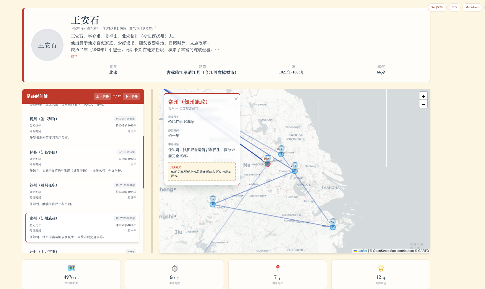
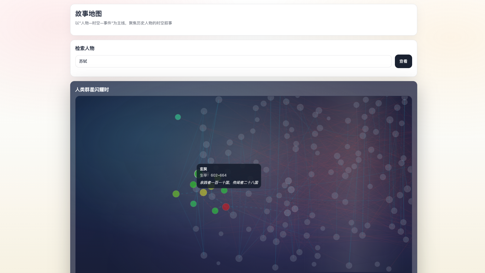
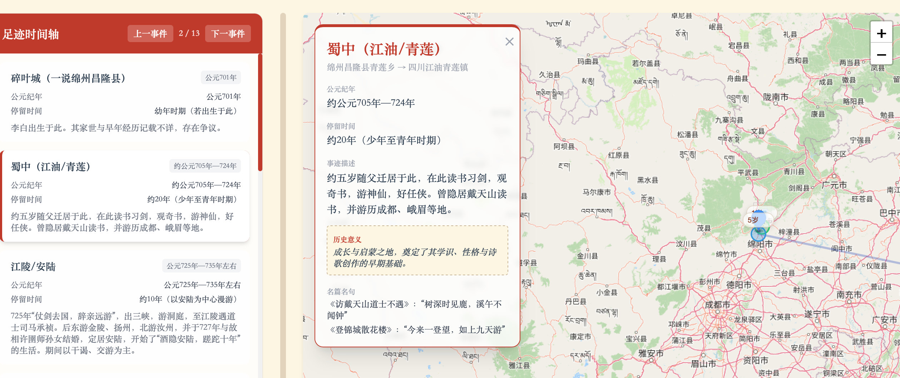
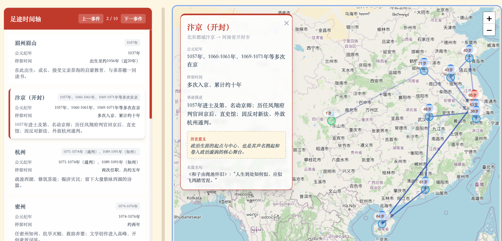
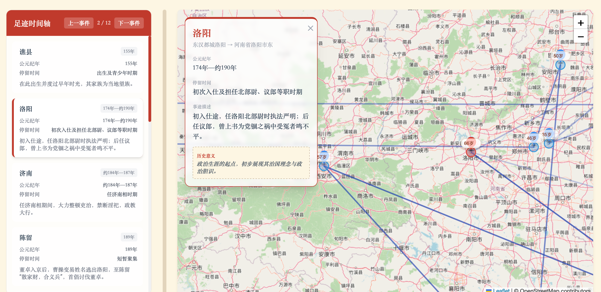

<h1 align="center">🗺️ 故事地图_StoryMap</h1>

<p align="center">
  <strong>从时空视角重构历史人物的生命轨迹</strong>
</p>

<p align="center">
  面向语文、历史、地理跨学科教学的互动式人物足迹地图项目
</p>

<p align="center">
  
  
  
  
  
  
  
</p>

<p align="center">
  <a href="https://www.bilibili.com/video/BV1aLoCBnEiN">故事地图视频演示</a> ·
  <a href="#快速开始">快速开始</a> ·
  <a href="#配置说明">配置说明</a> ·
  <a href="#项目结构">项目结构</a>
</p>

## 目录
- [项目概况](#项目概况)
- [适用场景](#适用场景)
- [演示](#演示)
- [环境要求](#环境要求)
- [快速开始](#快速开始)
- [配置说明](#配置说明)
- [无 LLM 也能体验什么](#无-llm-也能体验什么)
- [项目结构](#项目结构)
- [作者信息](#作者信息)

## 项目概况
**故事地图（StoryMap）** 面向文史爱好者，遵循 **“人物—时空—事件”** 的叙事主线，提供了地图可视化工具：输入一个名字，就生成可交互的足迹地图课件，知人论世，让历史人物的作品有了时空的分量。

🧭 **项目目标：**借助地图，我们可以把文学与历史研究中偏感性、经验性的“人物分析”，转成可回放、可检索的**时空轨迹**，关注行走与迁徙的线性轨迹，而不仅仅某个时间切片的个人经历。
**从时空视角重构历史人物生命轨迹，解决文史学习中“文本碎片化、时空理解弱、检索成本高”的痛点。**

🛠️ **技术方案：**
- **1. 输入姓名，生成故事**：通过 LLM 检索与整理资料生成结构化内容，重点抽取 **时间 - 地点 - 事件 / 作品 - 意义**。
- **2. 地理定位，完成落图**：集成 **高德地图 API** 进行古今地名对照与地理编码，实现位置信息的精准可视化。
- **3. 交互式地图课件呈现**：基于人物足迹、时间轴和事件节点生成联动页面，支持课堂展示、人物浏览与互动讲解。


## 🎯 适用场景
面向中学教学与文史学习场景，适合把人物、地点、事件和作品放回同一时空框架中理解。

- **语文人物专题课**：围绕李白、苏轼、辛弃疾等人物，将作品、行旅和人生转折放在地图与时间轴中联动讲解。
- **历史人物时空复盘**：从迁徙、贬谪、出使、征战、治学等轨迹切入，帮助学生理解人物处境与时代背景。
- **跨学科研学展示**：适合语文、历史、地理融合展示，也适合校本课程、研学汇报与文化展陈场景。

🌍 从更宏观的视角重看历史人物：沿着他的足迹，我们能更容易洞悉成长变化，也能看到他与其他人物在时空上的关联。

- **💡 辅助高效备课**：自动抓取人物生平，省去翻阅史料、查找古地名的繁琐过程。
- **📍 直观展现轨迹**：将文字叙述转化为地图足迹，人物生平一目了然。
- **📚 跨学科教学**：契合“大语文”、“大历史”教学理念，在地图中讲诗词，在地理中读历史。
- **✨ 吸引学生注意力**：生成可交互网页，支持时间轴联动和事件弹窗，让课堂更有参与感。

## 📸 演示
#### [故事地图操作展示](https://www.bilibili.com/video/BV1aLoCBnEiN)

演示内容包括：
- 人物页：人物要点 + 地图轨迹
- 主页：人类群星闪耀时 + 时间轴联动
- 人物页：地点连线与节点信息





主页默认展示：
- 搜索框：输入人物姓名，即可生成/跳转到人物页
- 时间轴：「人类群星闪耀时」关系图，查看历史长河中闪耀的人物群星
- 地图视角：从空间视角观察中国历史文化名人分布
- 支持拖动筛选，起止年份可自定义

人物页默认展示：
- 人物简介
- 空间轨迹
- 现代化足迹时间轴（年龄标签、生命进度、起点/终章样式）
- 对话窗口
- 考点信息


## 🧩 环境要求
- **Python 版本**：建议 `Python 3.11+`
- **Node.js 版本**：建议 `Node.js 22+`（用于 `web/` 前端开发）
- **依赖安装**：先安装项目依赖；如果你本地还没有装，可优先尝试 `pip install -r requirements.txt`
- **是否需要 `.env`**：需要。人物对话、实时生成人物页、以及高德地图底图都依赖环境变量配置
- **高德 Key 是否必填**：必填。当前人物页和主页都统一使用高德底图，没有高德 Key 页面地图无法正常加载

## 🚀 快速开始

### 本地一键体验
1) 启动新服务（`FastAPI`，提供主页、人物页生成、对话接口和 `/docs`）：
```bash
python3 storymap/script/story_map.py --serve --port 8766
```

2) 浏览器打开主页：
- `http://localhost:8766/`

3) 查看接口文档：
- `http://localhost:8766/docs`

4) 打开任意人物页后，可直接分享带地点状态的链接：
- 例如：`http://localhost:8766/苏轼.html#loc=3`
- 其中 `#loc=N` 表示人物页左侧时间轴中第 `N` 个地点节点（从 `0` 开始）

### 未收录人物
如果主页搜索框输入的人物不在当前库中，会通过服务端实时生成（需自动配置LLM接口），生成完成后自动跳转到人物页。
生成过程中会在主页显示“排队/执行进度”，建议保持页面打开并等待完成。

### 示例人物
- 苏轼
- 李白
- 辛弃疾

## 开发自检

每次修改 `storymap/script`、`tests` 或 `tools` 后，建议先跑统一自检入口：

```bash
python3 tools/run_storymap_checks.py
```

说明：

- 默认会先跑一轮 `ruff check --select F`，只拦截会影响运行的导入/名称类问题
- 然后执行一组核心回归测试，覆盖环境变量兼容、静态目录选择、任务流、模板和 Markdown 校验
- 若要跑完整测试集，可执行：

```bash
python3 tools/run_storymap_checks.py --all-tests
```

## 数据重建与重渲染

当前仓库的数据单源为：

- `storymap/examples/story/*.md`

推荐使用统一构建入口：

```bash
python3 tools/build_all.py --concurrency 8
```

这个脚本会统一重建：

- `data/people_master.json`
- `data/people_master_pep.json`
- `artifacts/story_map/stellar_home_data.json`
- `artifacts/story_map/index.html`

如果你只想重渲染全部人物页 HTML：

```bash
MAP_STORY_RENDER_CONCURRENCY=8 python3 cli/generate_pure_story_map.py --render-all --all-mode nogeocode
```

说明：

- `build_all.py` 默认是幂等的，适合在你更新了 `story/*.md` 后重新同步首页数据与人物索引。
- `build_all.py` 默认会先对当前 git 变更中的 Markdown 跑一次冒烟校验；若结构性错误会直接中止，避免把坏数据继续发布。
- `--all-mode nogeocode` 适合快速重渲染已有人物页，不额外触发新的地理编码请求。
- 如果只是本地体验现有仓库内容，通常只需要启动 `story_map.py --serve`，不必每次都重建。
- 每次 `build_all.py` 完成后，还会刷新：
  - `data/markdown_smoke_report.json`
  - `data/low_coverage_story_report.json`
  - `data/low_coverage_story_report.md`

## ⚙️ 配置说明
至少建议在 `.env` 中配置以下变量：

```env
AMAP_KEY=你的高德 JS Key
AMAP_SECURITY=你的高德安全密钥
MAP_STORY_API_BASE=http://127.0.0.1:8766

LLM_PROVIDER=minimax
LLM_API_KEY=你的大模型 Key
LLM_BASE_URL=https://api.minimaxi.com/anthropic
LLM_MODEL_ID=MiniMax-M3
```

说明：
- `AMAP_KEY`：用于主页和人物页加载高德地图 JS
- `AMAP_SECURITY`：高德安全密钥，配合前端地图加载
- `MAP_STORY_API_BASE`：静态站接回外部 FastAPI 时使用；本地开发可写 `http://127.0.0.1:8766`
- `LLM_PROVIDER`：当前推荐使用 `minimax`
- `LLM_API_KEY`：用于人物对话与新人物实时生成
- `LLM_BASE_URL`：MiniMax Token Plan 推荐为 `https://api.minimaxi.com/anthropic`
- `LLM_MODEL_ID`：默认推荐 `MiniMax-M3`
- 兼容说明：历史别名如 `Amap_API_Key`、`Amap_API_Secret`、`STORY_MAP_API_BASE` 仍可读取，但新配置请统一使用上面的标准名

## GitHub Pages 部署
仓库内已提供 GitHub Pages 工作流：

- `.github/workflows/deploy-pages.yml`

它会在推送 `main` 后自动完成：

- 批量重渲染人物页到 `artifacts/story_map`
- 重新生成首页 `index.html` 与 `stellar_home_data.json`
- 复制 `404.html` 并写入 `.nojekyll`
- 发布到 GitHub Pages

### 启用步骤
1. 进入 GitHub 仓库 `Settings -> Pages`
2. 将 `Source` 设为 `GitHub Actions`
3. 如需让线上页面直接加载地图，在仓库 `Settings -> Secrets and variables -> Actions` 中配置：
   - `Secrets`
   - `AMAP_KEY`
   - `AMAP_SECURITY`（可选）
4. 如需保留“实时生成”和“人物对话”，再配置：
   - `Variables`
   - `MAP_STORY_API_BASE=https://你的后端域名`

### 静态站能力边界
- GitHub Pages 只托管静态文件，不能直接运行 `FastAPI`
- 默认可用：主页浏览、人物检索、已生成人物页跳转、地图展示
- 需要单独后端：`/generate`、`/task`、`/api/ai/proxy`
- 若未配置 `AMAP_KEY`，页面会提示手动输入高德 Key，或使用 `?amapKey=xxx` 打开
- 页面会显示“静态演示版”提示条，明确说明当前是否已接入外部后端

### 当前静态部署适配清单
- 人物页改为支持 `MAP_STORY_STATIC_SITE=1` 静态模式
- 高德配置脚本改为相对路径加载，兼容仓库子路径 Pages
- 人物页对话在静态站下改为明确提示“需要单独部署后端”
- 首页生成人物/任务轮询改为可选后端能力，未配置后端时只展示现有内容
- 首页坐标回写接口改为可选调用，静态站默认跳过

### 本地模拟 GitHub Pages 构建
```bash
MAP_STORY_OUTPUT_DIR=artifacts/story_map \
MAP_STORY_STATIC_SITE=1 \
python3 cli/generate_pure_story_map.py --render-all --all-mode nogeocode

MAP_STORY_OUTPUT_DIR=artifacts/story_map \
MAP_STORY_STATIC_SITE=1 \
python3 tools/build_stellar_homepage.py --story-map-dir artifacts/story_map --story-md-dir storymap/examples/story

cp artifacts/story_map/index.html artifacts/story_map/404.html
touch artifacts/story_map/.nojekyll
```

## 🧠 无 LLM 也能体验什么
- **已有人物页可直接浏览**：仓库中已生成的人物 HTML 页面可以直接查看
- **主页可浏览现有内容**：可以查看首页时间轴、人物分布和已收录人物入口
- **新人物实时生成需要 LLM**：搜索未收录人物时，服务端需要调用大模型
- **人物对话功能需要 LLM**：人物页里的“开始对话”依赖后端大模型接口

## 人物 Markdown 规范
推荐每个人物文件都遵循以下主结构：

```md
# 人物名

## 一、人物档案

### 基本信息
- **姓名**：
- **时代**：
- **出生**：
- **去世**：
- **享年**：

### 生平概述
...

## 三、人生历程与重要地点（按时间顺序）

### 🟢 出生地：...
- **公元纪年**：
- **位置**：
- **事迹**：

### 📍 重要地点：...
- **公元纪年**：
- **位置**：
- **事迹**：

### 🔴 去世地：...
- **公元纪年**：
- **位置**：
- **经过**：

## 四、生平时间线

| 年份 | 年龄 | 关键事件 |
| :--- | :--- | :--- |
| ... | ... | ... |
```

校验命令：

```bash
python3 tools/validate_story_markdown.py
```

只校验当前改动文件：

```bash
python3 tools/build_all.py --markdown-smoke-check changed
```

说明：
- 校验器会检查必需章节、关键字段、时间线表头
- 校验器会调用解析器做一次离线解析，提示“地点为空”或“出生/去世地缺失”等高风险问题
- 当前默认只把结构性问题视为错误；地点过少等问题先作为 warning，方便逐步清理历史数据
- GitHub Pages workflow 会只校验本次 push 中改动过的 `storymap/examples/story/*.md`，用于拦截新增坏数据，不会被历史遗留文件阻塞

## 🗂️ 项目结构

```text
artifacts/
├── story_map/               # 构建产物目录：首页数据、首页产物、已生成人物 HTML/GeoJSON/CSV
storymap/
├── script/                 # 主服务、人物页渲染、地图与对话代理逻辑
├── examples/
│   └── story/              # 人物 Markdown 原始资料（单一数据源）
├── docs/assets/            # README 展示图片
cli/                        # 批量生成、重渲染、辅助脚本
tools/                      # 数据主索引、首页数据、统一构建脚本
data/                       # 人物主索引、坐标缓存、教材人物聚合结果
.env                        # 地图与 LLM 的本地配置
README.md                   # 项目说明
skill.md                    # Agent 技能说明文件
```


### ✅ 无奖测试
猜猜这些名句是谁写的？
1. 峨眉山月半轮秋，影入平羌江水流


2. 问余平生事业，黄州惠州儋州


3. 关东有义士，兴兵讨群凶



## 作者信息

作者：崔成 `cuichengzi@foxmail.com`
