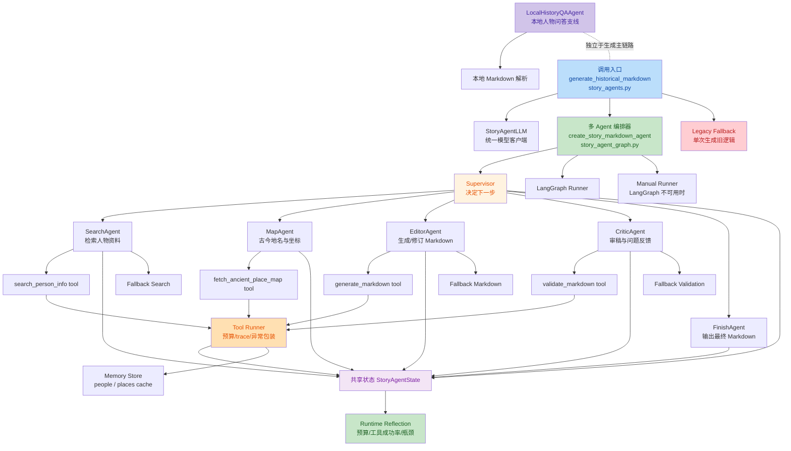
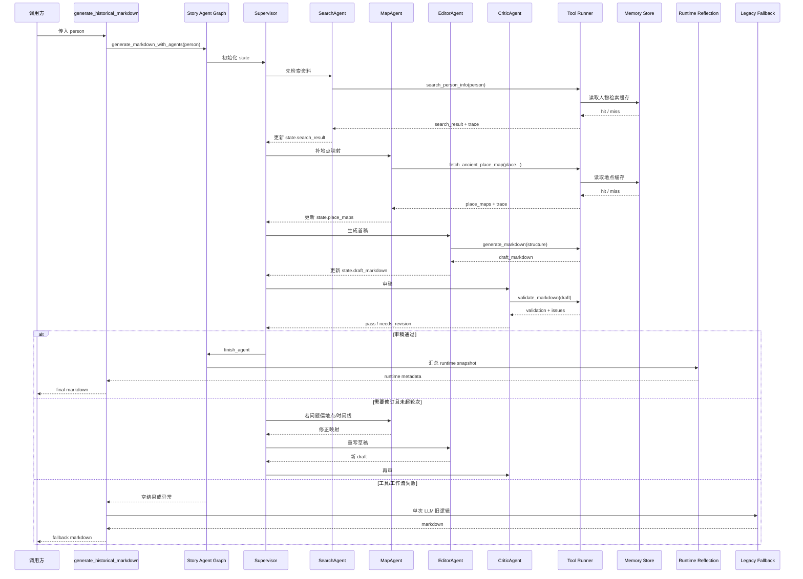

# StoryMap 维护地图

这份文档只回答 3 个问题：

1. 从哪里启动项目
2. 某一类问题应该去改哪个模块
3. 哪些目录是主流程，哪些只是工具脚本

## 一眼看懂主流程

### 运行时入口

- `scripts/start_storymap.sh`
  - 本地开发首选入口
  - 优先使用当前已激活环境，其次尝试 `.venv311` / `.venv`，最后回退到 `python` / `python3`
- `scripts/test_storymap.sh`
  - 本地回归测试入口
  - 默认执行 Ruff F 类检查 + 核心测试集
- `storymap/script/story_map.py`
  - Python 运行时总入口
  - 加载 `.env`
  - 做启动校验
  - 汇总对外兼容导出
- `storymap/script/runtime/api.py`
  - 运行时装配包装层
  - 负责 `_APP_RUNTIME`、`APP`、服务句柄和关闭钩子
- `storymap/script/runtime/helpers.py`
  - 运行时 helper 装配层
  - 负责 LLM client、local agent、vendor 资源、CORS 和输入校验包装
- `storymap/script/cli/entrypoints.py`
  - CLI / serve 入口包装层
  - 负责 `main()` 和启动分发
- `storymap/script/story_runtime_api.py` / `storymap/script/story_runtime_helpers.py` / `storymap/script/story_entrypoints.py`
  - 以上旧平铺路径仍保留兼容转发，排障时优先看新子包实现
- `storymap/script/agent/`
  - 面向 agent 架构的目录入口
  - 以 `core / generation / knowledge / runtime` 分组聚合能力
  - 新增装配层时优先放到这里，再按需要保留旧平铺模块做兼容

### 运行时装配关系

- `storymap/script/api/runtime_factory.py`
  - 把 `TaskService`、`ProxyService`、`StaticService` 装到一个 runtime 里
- `storymap/script/api/app.py`
  - 对外暴露 HTTP 接口
  - 主要包括 `/generate`、`/task`、`/api/ai/proxy`、静态页访问
- `storymap/script/api/runtime_factory.py`
  - 运行时装配主入口；旧 `storymap/script/app_factory.py` 兼容层已移除

## 核心模块分工

### 1. 页面生成链路

- `storymap/script/task.py`
  - 任务提交
  - 人物识别
  - 生成进度记录
  - 单人物 / 多人物结果聚合
- `storymap/script/generation_service.py`
  - 单人物生成总流程
  - 生成人物 Markdown
  - 地点解析
  - 渲染人物页
- `storymap/script/api/generation_api.py`
  - 单人物生成装配层
  - 汇总 generation tools、状态对象和 `generate_for_person` 兼容导出
  - 当前已按 LangGraph 可迁移的 state 形状整理
- `storymap/script/api/artifact_api.py`
  - 产物导出装配层
  - 对外整理 profile / multi 导出包装，继续减轻 `story_map.py` 入口负担
- `storymap/script/profile/builder.py`
  - 把人物 Markdown 转成前端可消费的数据结构
  - 这里适合做“知识点、作品、时间线、引用”的结构化增强
- `storymap/script/map/geocode_api.py`
  - 地点解析包装层
  - 对外整理 `resolve_place_coord`、古今地名切分与坐标兜底能力
- `storymap/script/api/profile_api.py`
  - `profile/builder.py` 与 `generation_service.py` 的装配层
  - 对外提供 `load_profile_from_md`、`build_points`、`render_html` 等兼容导出
- `storymap/script/profile/renderer.py`
  - 首页与多人物页的 HTML 生成
- `storymap/script/profile/templates/profile_page.html`
  - 人物页模板
  - 这里承载大部分前端交互、知识点、地图、对话区逻辑
- `storymap/script/story_generation_api.py` / `storymap/script/story_artifact_api.py` / `storymap/script/story_geocode_api.py` / `storymap/script/story_profile_api.py`
  - 以上旧平铺 API 入口仍保留兼容转发
- `storymap/script/profile_builder.py` / `storymap/script/map_html_renderer.py`
  - 以上旧平铺 profile 路径仍保留兼容转发，维护时优先查看新子包实现

### 2. 地图与地理解析

- `storymap/script/map/geocode_service.py`
  - 历史地名与坐标解析
- `storymap/script/map/map_client.py`
  - 地理编码、坐标补全和地图相关辅助逻辑

### 3. 问答与代理

- `storymap/script/proxy.py`
  - `/api/ai/proxy` 的代理逻辑
  - 优先本地回答，失败后回退到 LLM / fallback
- `storymap/script/history_qa_agent.py`
  - 基于本地人物档案的问答代理
- `storymap/script/story_agents.py`
  - LLM 调用、人物识别、人物 Markdown 生成

### 4. Markdown 解析与数据模型

- `storymap/script/parsers.py`
  - 人物 Markdown 的解析器
- `storymap/script/models.py`
  - 解析后的数据模型

### 5. 静态资源与导出

- `storymap/script/static.py`
  - 静态资源响应
- `storymap/script/artifacts.py`
  - HTML / GeoJSON / CSV 等产物导出
- `storymap/script/export_builders.py`
  - 导出数据拼装

## 目录怎么理解

### 主流程目录

- `storymap/script/`
  - 主服务与核心逻辑
- `storymap/examples/story/`
  - 人物 Markdown 单一数据源
- `artifacts/story_map/`
  - 首页、人物页、导出文件产物

### 维护时高频使用目录

- `tools/`
  - 构建、校验、索引工具
  - 真实实现已拆到 `build/`、`reports/`、`debug/`、`extras/`、`oneshot/`
  - 目录边界说明见 `tools/README.md`
- `tests/`
  - 回归测试
- `scripts/`
  - 本地便捷脚本，包括启动与测试入口
- `cli/`
  - 单次执行入口，目录边界说明见 `cli/README.md`

## 常见改动应该去哪里

- **改首页文案 / 交互**
  - `tools/build/build_stellar_homepage.py`
- **改人物页 UI / 知识点 / 对话区**
  - `storymap/script/profile/templates/profile_page.html`
- **改人物 Markdown 解析逻辑**
  - `storymap/script/parsers.py`
  - `storymap/script/profile/builder.py`
- **改生成流程或任务进度**
  - `storymap/script/task.py`
  - `storymap/script/generation_service.py`
- **改对话回答逻辑**
  - `storymap/script/history_qa_agent.py`
  - `storymap/script/proxy.py`
- **改接口路由**
  - `storymap/script/api/app.py`

## 建议的维护原则

- 尽量把“运行时逻辑”放在 `storymap/script/`
- 尽量把“批处理脚本”放在 `tools/` 或 `cli/`
- 页面 UI 变更优先只改模板，不先动生成链路
- 结构化数据增强优先放到 `storymap/script/profile/builder.py`
- 改完后优先跑：

```bash
scripts/test_storymap.sh
```

## Agent 架构

### 一眼看懂

- 当前项目里有 `2` 条 agent 主线：
  - `人物传记生成主链路`
  - `本地人物问答支线`
- 真正的多 agent 工作流主要服务于“生成人物 Markdown”，不是直接服务首页或人物页渲染。
- 生成主链路的核心结构是：
  - `Supervisor`
  - `SearchAgent`
  - `MapAgent`
  - `EditorAgent`
  - `CriticAgent`
  - `FinishAgent`
- 这些节点不是自由对话式 agent，而是围绕一份共享状态 `StoryAgentState` 做工程化编排。

### 模块图



### 调用时序图



### 关键代码入口

- 生成入口：
  - `storymap/script/story_agents.py`
- 编排核心：
  - `storymap/script/story_agent_graph.py`
- 路由规则：
  - `storymap/script/story_agent_router.py`
- 共享状态：
  - `storymap/script/story_agent_state.py`
- 工具执行器：
  - `storymap/script/story_agent_tool_runner.py`
- 缓存：
  - `storymap/script/story_agent_memory.py`
- 运行态反思：
  - `storymap/script/story_agent_runtime.py`
- 降级实现：
  - `storymap/script/story_agent_fallbacks.py`
- 本地问答 agent：
  - `storymap/script/history_qa_agent.py`

### 当前设计特点

- 优点：
  - 把“写人物传记”拆成检索、地名校正、写稿、审稿几段，职责清楚
  - 有预算、修订上限、缓存、fallback、runtime reflection，稳定性较强
  - 能记录 `execution_trace`、`tool_traces`、`memory_hits/misses`
- 薄弱点：
  - `StoryAgentState` 字段已经较多，后面容易继续膨胀
  - `Supervisor` 现在偏规则驱动，规则继续增长后维护成本会上升
  - 生成 agent 与页面构建链路仍是“串联关系”，还不是统一的产品级 orchestration

### Agent Runtime Schema 草案

- 目标：
  - `Executable`：任何一次 agent 运行都能被明确触发、复现和回放
  - `Inspectable`：任何一次运行都能看到计划、步骤、工具调用、降级原因和最终状态
  - `Stateful`：任何一次运行都能看到输入状态、过程状态、输出状态，以及跨次缓存命中情况
- 建议把当前分散的 `runtime / trace / debug / schema` 统一收口成 `AgentRuntimeEnvelope`

```json
{
  "schema_version": "agent-runtime/v1",
  "run_id": "string",
  "person": "string",
  "status": "ok|degraded|failed|empty",
  "started_at": "ISO-8601",
  "finished_at": "ISO-8601",
  "duration_ms": 0,
  "entrypoint": {
    "name": "generate_historical_markdown",
    "mode": "langgraph|manual|legacy"
  },
  "execution": {
    "langgraph_available": true,
    "used_legacy_fallback": false,
    "fallback": "",
    "error": "",
    "degraded_reasons": []
  },
  "budget": {
    "llm_calls_used": 0,
    "llm_calls_limit": 0,
    "max_revisions": 0,
    "revision_count": 0
  },
  "state": {
    "next_step": "",
    "has_search_result": false,
    "has_place_maps": false,
    "has_draft_markdown": false,
    "has_validation": false,
    "has_final_markdown": false
  },
  "plan": [
    "SearchAgent 检索资料",
    "MapAgent 补齐古今地名",
    "EditorAgent 生成 Markdown",
    "CriticAgent 评估并给出修正建议"
  ],
  "execution_trace": [
    "supervisor",
    "search_agent",
    "supervisor",
    "map_agent",
    "supervisor",
    "editor_agent",
    "supervisor",
    "critic_agent",
    "finish_agent"
  ],
  "tool_specs": [],
  "tool_traces": [],
  "memory": {
    "hits": {},
    "misses": {}
  },
  "result": {
    "markdown_ok": true,
    "validation_pass": true,
    "risk_level": "low|medium|high|unknown"
  }
}
```

### 推荐的 Trace Schema

- `execution_trace`
  - 记录高层步骤顺序
  - 例如：`supervisor -> search_agent -> map_agent -> editor_agent -> critic_agent`
- `tool_traces`
  - 记录每次工具调用的完整检查面
  - 推荐至少包含这些字段：

```json
{
  "tool_name": "search_person_info",
  "agent_step": "search_agent",
  "success": true,
  "attempt": 1,
  "duration_ms": 1234,
  "timed_out": false,
  "permission": "network_read",
  "cost_tier": "medium",
  "memory_bucket": "search",
  "memory_hit": false,
  "error": "",
  "input_summary": "李白",
  "output_summary": "已返回结构化 search_result"
}
```

### PDCA 展示方式

- 可以把每次 agent 执行映射成 `PDCA` 视图，而不是暴露原始逐字推理
- 推荐映射如下：
  - `Plan`
    - `state.plan`
    - `next_step`
    - `llm_calls_limit`
  - `Do`
    - `execution_trace`
    - `tool_traces`
    - 各 agent 的实际工具调用
  - `Check`
    - `validation`
    - `critic_feedback`
    - `runtime_reflection`
  - `Act`
    - `revision_count / max_revisions`
    - `degraded_reasons`
    - `fallback`
    - `finish_agent` 是否完成收口
- 这样既能让运行过程可检查，又不会把内部原始思维链直接暴露到产品层

### 人机料法环测归因框架

- 可以把 agent 的运行与排障统一映射到 `人 / 机 / 料 / 法 / 环 / 测`
- 这套框架适合两个场景：
  - `运行中观察`
  - `异常后归因与修复`
- 推荐把它作为 `PDCA` 的补充视图：
  - `PDCA` 负责展示执行节奏
  - `人机料法环测` 负责展示故障归因面

#### 维度定义

- `人`
  - 谁在决策、谁要人工复核、谁负责验收
  - 在当前实现里主要对应：
    - `Supervisor`
    - `CriticAgent`
    - 人工验收与人工修订入口
- `机`
  - 模型、工具执行器、fallback、外部服务是否正常
  - 主要对应：
    - `StoryAgentLLM`
    - `tool runner`
    - `tool_traces`
    - `legacy fallback`
- `料`
  - 输入资料、Markdown、地点数据、检索结果是否充足且一致
  - 主要对应：
    - `search_result`
    - `place_maps`
    - `draft_markdown`
    - `validation`
- `法`
  - 当前方法是否合理，包括工作流、修订轮次、fallback 策略
  - 主要对应：
    - `execution_trace`
    - `revision_count / max_revisions`
    - `degraded_reasons`
    - `PDCA`
- `环`
  - 运行环境是否稳定，包括 LangGraph、网络、缓存、限流
  - 主要对应：
    - `langgraph_available`
    - `timed_out_calls`
    - `memory_hits / memory_misses`
    - `used_legacy_fallback`
- `测`
  - 观测面是否齐备，能否定位问题、复盘问题、验证修复
  - 主要对应：
    - `execution_trace`
    - `tool_traces`
    - `runtime_reflection`
    - `validation`
    - `PDCA`

#### 排障顺序

- 第一层：先看 `测`
  - trace 是否齐
  - tool 调用是否可见
  - validation 是否存在
  - 如果观测面不全，先补观测，不直接拍脑袋修
- 第二层：再看 `机` 和 `环`
  - 工具失败、超时、LLM 预算打满、fallback 触发，通常优先说明是执行链路或环境问题
- 第三层：再看 `料`
  - 如果搜索结果、地点映射、草稿或校验缺失，通常是输入或中间数据不足
- 第四层：最后看 `法` 和 `人`
  - 如果链路能跑通但反复修不对，通常是工作流方法、规则阈值或人工验收策略要调整

#### 推荐的 Debug 输出结构

```json
{
  "status": "stable|watch|degraded|empty",
  "person": "李白",
  "human": {
    "label": "人",
    "summary": "已记录本轮负责人、人工介入点与修订责任。",
    "findings": [],
    "repair_actions": []
  },
  "machine": {
    "label": "机",
    "summary": "已记录 LLM、工具调用与 fallback 状态。",
    "findings": [],
    "repair_actions": []
  },
  "material": {
    "label": "料",
    "summary": "已记录输入资料、地点数据与草稿产物状态。",
    "findings": [],
    "repair_actions": []
  },
  "method": {
    "label": "法",
    "summary": "已记录工作流、修订轮次与 fallback 策略。",
    "findings": [],
    "repair_actions": []
  },
  "environment": {
    "label": "环",
    "summary": "已记录运行环境、缓存与依赖波动情况。",
    "findings": [],
    "repair_actions": []
  },
  "measurement": {
    "label": "测",
    "summary": "已记录 trace、校验和调试观测面。",
    "findings": [],
    "repair_actions": []
  }
}
```

#### 具体使用方式

- `测` 不完整：
  - 先补 `tool_traces / validation / runtime snapshot`
  - 否则不进入正式归因
- `机` 异常：
  - 先看失败工具、超时工具、LLM 预算、fallback
  - 优先做局部修复，不要立刻重跑整条链路
- `料` 异常：
  - 先确认 `search_result / place_maps / draft_markdown` 哪一层缺失
  - 先补数据，再调规则
- `法` 异常：
  - 看是不是修订轮次过多、流程提前终止、FinishAgent 未进入
  - 这种问题通常需要调整编排策略
- `环` 异常：
  - 重点看网络、缓存、LangGraph 可用性、限流与超时
- `人` 异常：
  - 主要体现在需要人工复核但没有明确介入点，或 Critic 建议未真正落地

#### 当前代码落点

- 归因构建：
  - `storymap/script/story_agent_runtime.py`
- debug 输出：
  - `storymap/script/story_task_debug.py`
- HTML 调试页：
  - `/task/debug?id=<task_id>`

#### 和修复动作如何联动

- 推荐在 debug 页先看：
  - `Runtime Reflection`
  - `PDCA View`
  - `6M View`
- 再按下面顺序修：
  1. `测` 不足先补观测
  2. `机 / 环` 失败先恢复链路
  3. `料` 缺失先补数据
  4. `法` 不合理再改编排
  5. `人` 负责最终人工复核和验收

#### 当前这套框架能做到什么

- 已经可以做到：
  - 把一次 agent 执行按 `人机料法环测` 输出成结构化 debug 视图
  - 在出现失败、降级、超时、修订过多时给出归因方向和修复建议
- 还没完全做到：
  - 自动生成跨多次运行的对比报告
  - 自动基于 6M 结果触发下一轮自修复策略

### 当前项目离这个目标还差什么

- `Executable`
  - 已经基本具备
  - 有统一入口、统一 runner、统一 tool 执行器
- `Inspectable`
  - 已经做了大半
  - 已有 `tool_specs / execution_trace / tool_traces / degraded_reasons / request trace`
  - 还差统一外部 envelope 和统一调试出口
- `Stateful`
  - 已有执行态 state 与轻量 memory cache
  - 还差更明确的“状态快照分层”和可回放历史

### 建议的下一步收口顺序

- 第一步：
  - 统一 `AgentRuntimeEnvelope`
  - 让 `story_agent_runtime.py`、`story_task_schema.py`、`story_task_debug.py` 都围绕同一份 schema 输出
- 第二步：
  - 统一 `tool_traces` 字段
  - 给每条 trace 补 `agent_step / input_summary / output_summary`
- 第三步：
  - 增加 `state snapshot` 分层
  - 区分：
    - 输入状态
    - 中间状态
    - 最终状态
- 第四步：
  - 做单独的 agent debug 视图或接口
  - 不再只让 trace 分散在 task debug 和运行时对象里
